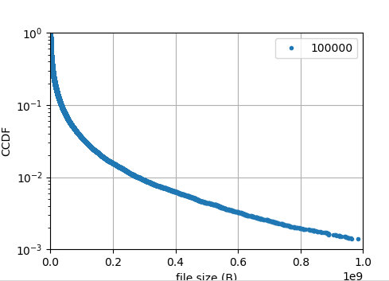
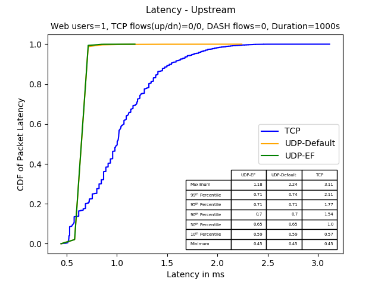
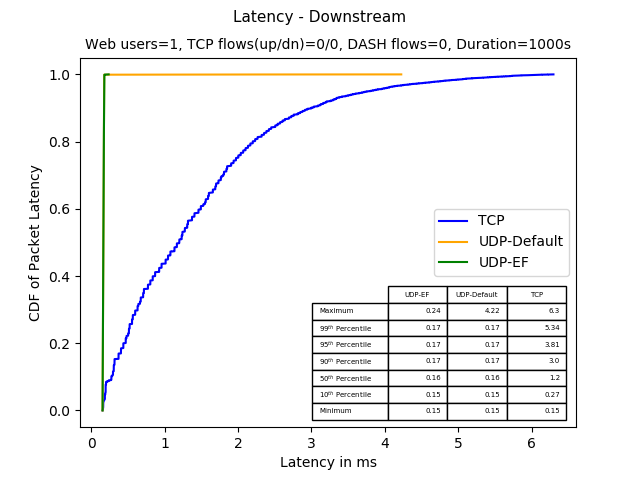
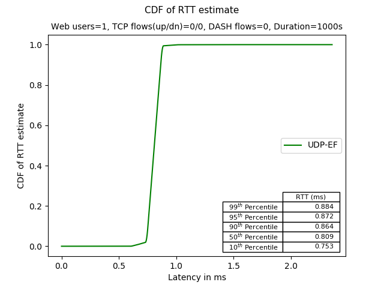
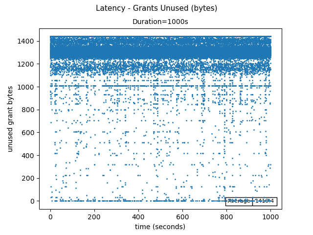
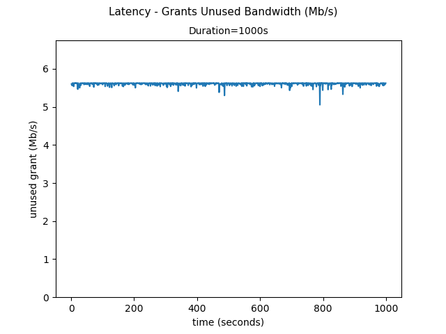

# ns-3 DOCSIS "residential" experiment documentation

## 1. Introduction

This experiment uses a bash script (residential.sh) to launch the residential-example.cc program in order to investigate low latency DOCSIS performance in a set of traffic scenarios. 

**residential.sh** executes a number of traffic scenarios in parallel, and then
pipes each output into a Python program named 'auto.py' that uses
matplotlib and numpy to create a PDF file that summarizes the scenario.  residential.sh then calls summary-report.py to generate an overall summary of the experiment results.

**residential-example.cc** is a program to evaluate TCP and application performance in
the context of a data-over-cable scenario using ns-3 models of active
queue management (AQM) and DOCSIS 3.1 and experimental devices. This
document describes the program configuration and output data, and some
experiment scripting frameworks used for three targeted studies. The
DOCSIS model is described in separate documentation.

The primary modeling goals of residential-example.cc and its associated scripts 
are to automate the generation of latency and other performance statistics
for a hypothetical DOCSIS configuration, to evaluate advanced schedulers
and AQMs on the DOCSIS upstream (cable modem).

## 2. Experiment overview

###2.1 Simulation Topology

The following figure (taken from residential-example.cc) represents the topology.

~~~
//   residence                                      wide-area network
//   ---------                                      -----------------
//
// udpEfClient--+---+                                  ---------------
//              | b |                               ---| udpEfServer |
// udpClient----| r |                           (3)/   --------------
//              | i |  ------  -------- (2) -------- (4) -------------
// tcpClient----| d |--| CM |--| CMTS |----| router |----| udpServer |
//              | g |  ------  --------     --------     -------------
// dctcpClient--| e |       (1)             | | \  \(5)---------------
//              |   |                       | |  \  ---|dashServer(0)|
// webClient0---+---+                       | |   \    ---------------
//                                          |  \   \   ---------------
// Default one-way link delays               \  \   ---|dashServer(1)|
// -------------------                        \  \     ---------------
// (1) 40 us (see below)                       \  \         ...
// (2) 0 ms (bridged to CMTS)                   \  \(6)---------------
// (3) 2 ms                                      \  ---| tcpServer(0)|
// (4) 2 ms                                       \    ---------------
// (5) 10 ms                                       \        ...
// (6) variable (2 ms + i*3ms)                      (7)  -------------
// (7) 5 ms                                          ----| webServer |
//                                                       -------------
//
// Note:  Delay (1) set indirectly from the DocsisNetDevice::MaximumDistance
// attribute, which works out to 40 us one-way for the default value
~~~

**Figure 1: residential-example.cc topology**

At the center of Figure 1 are two nodes to represent a single cable
modem (CM) and cable modem termination system (CMTS). The DOCSIS models impose rate
controls (token bucket filters) and precise models for the notional
upstream and downstream delay between CM and CMTS.
ns-3 DOCSIS models are described in more detail elsewhere.

The left-hand-side of Figure 1 depicts a hypothetical customer premises
network. Five nodes are interconnected by a layer-2 bridge, and the
overall network is modeled abstractly as a high-speed LAN (1 Gbps link
rate, 1us delay) connected to the CM. The CM and CMTS are functionally
layer-2 bridge devices, and the CMTS is connected to a router to enable
the addition of notional WAN links with varying RTT and delay.

On the right of the CMTS and router are a number of servers associated
with the notional wide-area network (WAN). These servers are
interconnected to the router by ns-3 PointToPoint links that are
high-speed (1 Gbps) but variable delay, with one-way delays ranging
upwards from 1ms.

### 2.2 Traffic Patterns

#### 2.2.1 Simulation scenarios defined in residential.sh

 1.       Single gaming flow (UDP up/down) with default DSCP; Single gaming flow with DSCP=EF; single web user
 2.       Same as 1, but add 1 Dash user
 3.       Same as 1, but add 1 TCP upstream
 4.       Same as 1, but add 1 TCP downstream
 5.       Same as 1, but add 1 TCP upstream and 1 TCP downstream
 6.       Same as 1, but add 5 TCP upstream and 5 TCP downstream
 7.       Same as 1, but add 5 TCP upstream and 5 TCP downstream and 2 Dash users (start times staggered by 1 second)
 8.       Same as 1, but 5 web users
 9.       Gaming flow w/ DSCP-0, gaming flow w/ DSCP-EF; 16 downstream TCPs (speedtest)
 10.      Gaming flow w/ DSCP-0, gaming flow w/ DSCP-EF; 8 upstream TCPs (speedtest)
 11.      Similar to scenario 5, but with DCTCP substituted for TCP
 12.      Same as 11, but with 1 TCP upstream and downstream added, and 1 web user
 13.      Same as 12, but with 3 TCP upstream and downstream and 2 DCTCP upstream and downstream

For example, the following configuration is called 'scenario\_id 1', and
is described as follows.

~~~
# Scenarios:

# 1. Single gaming flow (UDP up/down) with default DSCP; Single gaming
#    flow with DSCP=EF; single web user

declare -a scenario=(\
#       S# TDn TUp DASH DDn DUp DDASH Web dStart dStep  fileModel simTime
        "1  0   0   0    0   0    0    1   10ms   10ms  empirical 1000s"
~~~

#### 2.2.2 Application flows defined in residential-example.cc

Each application flow referenced in residential.sh corresponds to a flow definition in residential-example.cc.  Application flows include the following (four UDP flows, downstream
MPEG-DASH, upstream and downstream TCP file transfers, and downstream
HTTP):

1\) **UDP high priority data streams** in the **upstream** direction
from the node 'udpEfClient' to node 'udpEfServer'. Notionally this is a
low-latency gaming flow. The number of flows is configurable, to allow
the user to adjust the upstream bandwidth.

The upstream Ethernet frame size is selected according to a normal
random variable, to result in a mean frame size of 128 bytes and 
standard deviation of 20 bytes. These statistics are at the Ethernet 
frame level, but the random variable that selects the UDP payload size
is configured in terms of the mean application data unit (82 bytes)
and variance (400 bytes) instead of standard deviation.  The value of
82 bytes results from backing off the target 128 bytes by 14 + 4 bytes 
(Ethernet) + 20 bytes (IP) + 8 bytes (UDP) header size. 
Although it would be possible to make further
adjustments for small frame sizes to account for Ethernet padding,
testing indicated that this will not make a difference. As a result, the
random variable in the traffic generator is configured to a mean of 
82 bytes and variance of 400 bytes.

The upstream frame interarrival time is configured to result in a mean
of 33 ms and standard deviation of 3 ms. As a
result, the upstream bit rate is 128 \* 8 bits/0.033 sec or 31 Kb/s.

The point-to-point link delay from the router to the server is 1 ms, but
this value is inconsequential since it only affects packet delivery
latency after the DOCSIS link has been traversed.

2\) **UDP best effort data streams** in the **upstream** direction from
the node udpClient to udpServer. This is configured the same as the high
priority stream (same interarrival and packet size distributions).
Latency of the links is also the same. The number of flows is
configurable, to allow the user to adjust the upstream bandwidth.

3\) **UDP high priority data streams** in the **downstream** direction
from the node 'udpEfServer' to node 'udpEfClient'. This is a reverse
direction flow configured similarly to the upstream direction, except
that the packet size and random intervals have different distribution
characteristics. The number of flows is configurable, to allow the user
to adjust the downstream bandwidth.

The downstream Ethernet frame size is selected according to a normal
random variable with mean of 450 bytes and standard deviation of 120
bytes. These statistics are at the Ethernet frame level, and as in
the upstream case, the application level mean (404 bytes) represents
the target of 450 bytes backed off by 14 + 4 bytes (Ethernet) + 20 bytes 
(IP) + 8 bytes (UDP) header size. The random variable is configured to a mean of
404 bytes and variance of 14400 bytes.

The downstream frame interarrival time is selected according to a normal
random variable with mean of 33 ms and standard deviation of 5 ms. As a
result, the downstream bit rate (per flow) is 450 \* 8 bits/0.033 sec or
109 Kb/s.

The point-to-point link delay from the router to the server is 1 ms, but
this value is inconsequential since it only affects packet delivery
latency before the DOCSIS link has been traversed.

4\) **UDP best effort data streams** in the **downstream** direction from
the node udpClient to udpServer. This is configured the same as the high
priority stream (same interarrival and packet size distributions).
Latency of the links is also the same. The number of flows is
configurable, to allow the user to adjust the downstream bandwidth.

5\) **MPEG-DASH file transfer flows**in the **downstream** direction, from TCP
server nodes to one of the two TCP client nodes, notionally modeling
MPEG/DASH streaming over TCP

The current DASH model is highly abstracted, reusing the ns-3
FileTransferApplication to schedule repeated downloads of 3.75 MB files
every 5 seconds. This results, with the default base RTT of 20 ms (see
below), in an average throughput of 6 Mb/s. However, to approximate the
variability due to rate adaptation, the flow will either complete within
the first 2.5 seconds or else the file transfer will be truncated after
2.5 seconds.

Each DASH server is separately connected to the router via a dedicated
ns-3 PointToPoint link, with a one-way delay of 'dashDelayStart'
(default 9 ms) and an incremental delay of 'dashDelayStep' (default 0
ms). That is, the first DASH server will be at 'dashDelayStart' from the
router, the second will be at 'dashDelayStart' plus 'dashDelayStep' from
the router, the third will be at 'dashDelayStart' plus two times
'dashDelayStep', etc. With these default base link delays, the DASH RTT
starts at 20 ms. Two TCP clients (tcpClient0 and tcpClient1) are
selected in alternating fashion for each DASH server.

6\) **TCP file transfer flows** in the **downstream** direction, from TCP
server nodes to one of the two TCP client nodes, notionally modeling
large file transfers over TCP

The ns-3 FileTransferApplication is configured as a repeating file
transfer with file sizes drawn from a LogNormal distribution generated
to try to match the complementary CDF plotted in a recent
publication[^1^](#sdfootnote1sym). Connections will restart after a
brief reading time of 100 ms. The comparison between the ns-3
distribution and the published distribution is shown below.

**Figure 2:  File size distribution in MB (from (1))**

**Figure 3:  Corresponding ns-3 CCDF for 100000 values**

Each TCP server is separately connected to the router via a dedicated
ns-3 PointToPoint link, with a one-way delay of 'tcpDelayStart' (default
1ms) and an incremental delay of 'tcpDelayStep' (default 3ms). That is,
the first TCP server will be at 'tcpDelayStart' from the router, the
second will be at 'tcpDelayStart' plus 'tcpDelayStep' from the router,
the third will be at 'tcpDelayStart' plus two times 'tcpDelayStep', etc.
Two TCP clients (tcpClient0 and tcpClient1) are selected in alternating
fashion for each TCP server.

7\) **TCP file transfer flows** in the **upstream** direction, from TCP
client nodes to TCP server nodes, notionally modeling large file
transfers over TCP.

The ns-3 upstream FileTransferApplication is configured the same as the
downstream FileTransferApplication described above. Note that in the
upstream, the roles of client and server are reversed (the 'client' node,
on the customer premises network, transfers the file to the server).
Each TCP client is connected to a TCP server, starting with the first
TCP server. The TCP clients alternate if there is more than one
connection.

8\) a **web browsing model** in the **downstream** direction, according to the
ns-3 3GPP HTTP model.

In general, most model defaults are used (as originally specified in
3GPP specifications).

### 2.3 Main simulator parmeters

Several parameters are defined at the top of the residential.sh file (for
all scenarios) as follows:

~~~
export heading="Residential"
export downstreamMsr=200Mbps
export upstreamMsr=50Mbps
export guaranteedGrantRate=5Mbps
export linkDelayWebServer=4ms
export ftpStartTime=100ms
export numUdpEfUp=1
export numUdpBeUp=1
export numUdpEfDown=1
export numUdpBeDown=1
export enableTrace=false
export enablePcap=false
export saveDatFiles=false
export RngRun=1
export queueDepthTime="250ms"
~~~

The most likely parameters in this section that an experimenter would change are:

**downstreamMsr:** Downstream Maximum Sustained Traffic Rate

**upstreamMsr:** Upstream Maximum Sustained Traffic Rate

**guaranteedGrantRate:** if non-zero, enables and specifies the GGR

**enableTrace:** whether to enable ASCII traces

**enablePcap:** whether to enable pcap traces

**saveDatFiles:** whether to save the trace data files that are parsed for plotting output

**RngRun:** the ns-3 RNG run number (random number seeding)

### 2.4 Data collection

The program is instrumented to provide the following output data:

1\) **PCAP trace of the CPE-facing interface** on the cable modem
(default file name 'latency.pcap'). This trace can be read by Wireshark
or other pcap tools.

2\) a **“file transfer completion” log** (default file name
'fileTransferCompletion.dat') that records the following information
each time that a file transfer completes:

  1) timestamp
  2) duration of the file transfer
  3) application bytes transferred
  4) throughput in Mb/s

3\) a **“page load time” log for web downloads** (default file name
'pageLoadTime.dat'). This file is a simple time-series log of simulation
timestamp followed by page load time in seconds.

4\) **upstream latency** for all packets traversing the DOCSIS upstream
net device (default file name 'latency-CM.dat')

The latency is measured from the time of enqueue of the packet into the
feeder queue at the CM, until the time that it leaves the CMTS.
This captures device queuing delay, delays notionally due to frame or
symbol preparation for transmission, transmission delay, and notional
decoding delay on the far side. As an example, the minimum delay
upstream is 445 us, based on a 135 us frame duration. The
minimum delay of 445 us accounts for the one frame delay that would
occur (for frame preparation) if a high priority packet arrived just
before a frame boundary, and was dequeued at time (n-1) frame intervals,
for transmission at time n, plus the time to transmit the frame (another
135 us), the one-way propagation delay (40 us), and the time to decode
the frame on the receiving end (a final 135 us). The delays are longer
if packets are enqueued behind others, arrive asynchronously to the
frame boundary, and/or if the packet must wait in a pipeline for the
request for a grant to be scheduled.

Sample output:

    0.139185 5.62803 10.1.1.1 10.1.2.2 154 17 b9

with the columns representing 1) simulation timestamp (s), 2) latency (ms), 3) IP
source, 4) IP destination 5) packet size, 6) protocol (17 for UDP, 6 for
TCP) and 7) TOS field.

5\) **downstream latency** for packets traversing the DOCSIS downstream
net device (default file name 'latency-CMTS.dat'). Similar to the
upstream latency measure, this captures latency of enqueuing and symbol
preparation for the downstream transmission, plus the symbol
transmission time, propagation delay, and decoding delay on the far
side.

Sample output:

    0.181125 0.172275 10.1.2.2 10.1.1.1 322 17 b9

with the columns representing 1) simulation timestamp (s), 2) latency (ms), 3) IP
source, 4) IP destination 5) packet size, 6) protocol (17 for UDP, 6 for
TCP) and 7) TOS field.

6\) a log of **unused grant bytes** (default file name 'grantsUnused.dat')

A time-series representation (one value per MAP interval) of the number
of bytes unused in the MAP interval just concluded.

7\) a log of **unused bandwidth** (default file name 'unusedBandwidth.dat')

A time-series representation (one value per second of simulation) of the
amount of unused bandwidth (Mb/s).

There are additional scripting frameworks (discussed below) to manage
parametric studies, making use of this output, and provide plots of
data.

### 2.5 Output

The script will save all program data in a directory named
'results/\<name\>/\<timestamp\>' where the \<name\> argument is
specified as a command-line argument to 'residential.sh' and the timestamp
is auto-generated. The following plots are generated, and concatenated
into a single PDF called 'results\<\#\>.pdf', where the scenario\_id is
used for the number in the filename.

1\) CDF of upstream latency

CDFs plotted for upstream latency for three classes of traffic: 1) UDP
EF, 2) UDP best effort, and 3) TCP packets.

**Figure 4:  Upstream CDF**

2\) CDF of downstream latency

CDFs plotted for downstream latency for three classes of traffic: 1) UDP
EF, 2) UDP best effort, and 3) TCP packets.

**Figure 5:  Downstream CDF**

3\) CDFs of the round trip time

Round trip time is not explicitly measured but is estimated based on the
assumption that the upstream and downstream latencies are sampled from
independent random processes. In such a case, we seek the distribution
of Z = X + Y (X is the upstream latency distribution, and Y is the
downstream). The probability mass function (pmf) of Z can be obtained by
convolving the pmfs of X and Y, and we have empirical pmfs available for
X and Y, as well as convolution support in Python Numpy module.

Below is an example plot, which only traces the estimated RTT CDF of the
UDP-EF upstream flow(s); this plot is the first plot in the set of
results that the scripts bind together.

**Figure 6:  RTT CDF**

4\) CDF of page load time

CDF of page load time for web traffic.

**Figure 7:  Page load time CDF**

If the predictive scheduler is enabled, two additional plots are generated.

5\) Grants unused (bytes)

Time-series of the number of unused bytes at the end of each MAP
interval (approx. 500 MAP intervals per second).

**Figure 8:  Grants unused (bytes)**

6\) Grants unused (Mb/s)

Time-series of the average bandwidth unused (samples taken once each
second).

**Figure 9:  Bandwidth unused (Mb/s)**

A final step in the scripting framework is the generation of a summary
report PDF (summary.pdf), containing a tabular summary of all of the
simulation runs configured in residential.sh, and an estimated RTT CDF plot
for all of the simulation scenarios aggregated together.

[1](#sdfootnote1anc)H. Habibi Gharakheili, V. Sivaraman, T. Moors, A.
Vishwanath, J. Matthews and C. Russell, "Enabling Fast and Slow Lanes
for Content Providers Using Software Defined Networking," in *IEEE/ACM
Transactions on Networking*, vol. 25, no. 3, pp. 1373-1385, June 2017.

