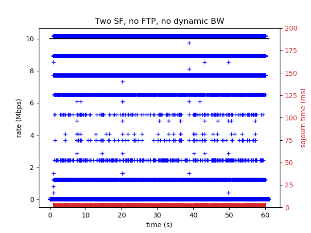
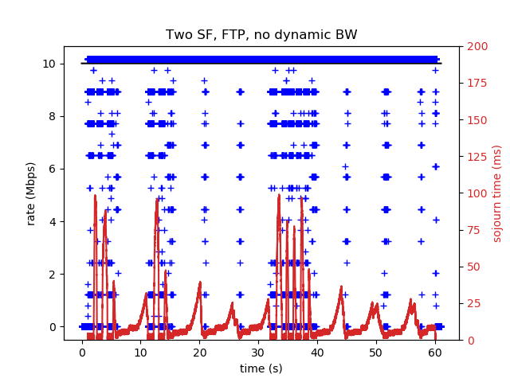
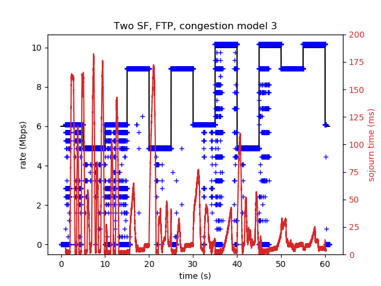
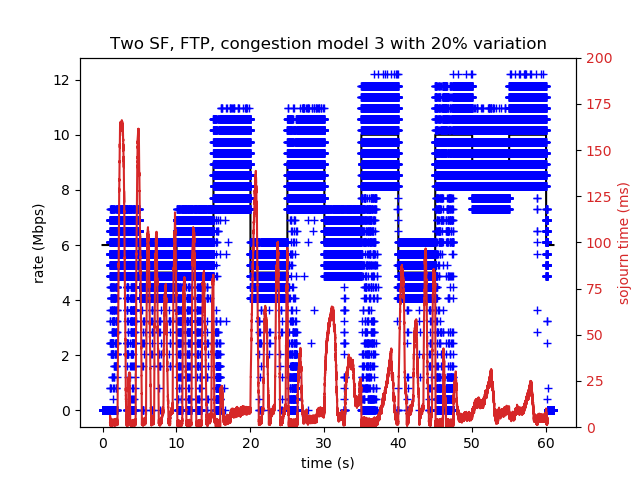

# ns-3 DOCSIS "simple-docsislink" experiment documentation

## 1. Introduction

This experiment uses a bash script (**simple-docsislink.sh**) to launch the 
**simple-docsislink.cc** program in order to investigate the impact of 
congestion on the uplink.

**simple-docsislink.cc** is a port of ns-2's simple-docsislink.tcl.  This
example is designed to illustrate DOCSIS link behavior when the CMTS 
scheduler is congested and not able to make consistent bandwidth grants at
the specified Maximum Sustained Rate (MSR). The downstream direction is not
subjected to congestion, and only upstream data flows are defined.

**simple-docsislink.sh** runs four configurations and generates a subdirectory
for each.  The different configurations are described below (other combination
are possible but not shown herein).

~~~
#scenario arguments:  scenario_id numServiceFlows congestion freeCapacityVariation enableFtp udpRate scenario_name
declare -a scenario=(\
#       S# NSF cong free ftp udpRate name 
        "1  2   0   0   0    5Mbps Two SF, no FTP, no dynamic BW"
        "2  2   0   0   1    5Mbps Two SF, FTP, no dynamic BW"
        "3  2   3   0   1    5Mbps Two SF, FTP, congestion model 3"
        "4  2   3   20  1    5Mbps Two SF, FTP, congestion model 3 with 20% variation"
        )
~~~

The script creates a subdirectory with a number of files for each scenario:

~~~
log1.out                          simple-docsislink.grants.dat
simple-docsislink.attributes.txt  simple-docsislink.png
simple-docsislink.config.txt      simple-docsislink.sojourn.dat
simple-docsislink.flows.txt       simple-docsislink.tr
~~~

The Python program **plot-grants-sojourn.py** creates a plot named
**simple-docsislink.png** in each directory, which displays two time-series
quantities: 1) the instantaneous classic grant rate, and 2) the classic
queue sojourn time. Other files include an ASCII packet trace, ns-3
FlowMonitor output for all flows, and a log of the physical layer
configuration and attribute values in use.

## 2. Experiment overview

###2.1 Simulation Topology

The following figure (taken from simple-docsislink.cc) represents the topology.

~~~
// n0   <-------> n1 <---------> n2 <---------> n3
//                CM            CMTS
~~~

**Figure 1: simple-docsislink.cc topology**

At the center of Figure 1 are two nodes to represent a single cable
modem (CM) and cable modem termination system (CMTS). The DOCSIS models impose rate
controls (token bucket filters) and models for the notional
upstream and downstream delay between CM and CMTS.
ns-3 DOCSIS models are described in more detail elsewhere.

Command-line options are listed in the program comments:
~~~
// The program provides the following command-line arguments:
//    --simulationEndTime:      Time to end the simulation [+61e+09ns]
//    --numServiceFlows:        Number of service flows (1 or 2) [1]
//    --congestion:              toggle DOCSIS congestion model (0-3) [1]
//    --dynamicInterval:        time spent at each throughput rate in congestion model (sec) [+5e+09ns]
//    --freeCapacityVariation:  Free capacity variation (percentage) [20]
//    --enableFtp:              Enable the FTP flow [true]
//    --udpRate:                Data rate of the UDP flow [5000000bps]
//    --packetErrorRate:        Packet error rate of upstream data [0]
//
~~~

The upstream MSR is 10Mbps, and the upstream Peak Rate is 20Mbps; no PGS
is configured.  The program can be configured for one or two service flows,
but presently, traffic is generated only on the classic service flow.

### 2.2 Traffic Patterns

There are currently two traffic flows that can be defined:  1) a classic
UDP (constant bit rate, or CBR) flow at around 5 Mbps, and 2) a classic TCP
file transfer (FTP).  Scenario 1 configures only the classic CBR flow,
and scenarios 2-4 configures additionally a classic TCP file transfer.

#### 2.3 Congestion scenarios

There are three congestion scenarios defined in the C++ program, to limit the number of
available minislots granted.  The `congestion` parameter, if set to zero,
disables congestion, but if set to the value between one and three, will
limit the available upstream capacity according to one of three defined
patterns, switching between states every `dynamicInterval` period
(which defaults to 5 seconds).  When **simple-docsislink.cc** is run 
without any arguments, it displays the following congestion pattern,
varying around the nominal 10 Mbps at five second intervals.

~~~
change at +0s to mean free capacity 10 Mbps
change at +5s to mean free capacity 8.25 Mbps
change at +10s to mean free capacity 10 Mbps
change at +15s to mean free capacity 11.25 Mbps
change at +20s to mean free capacity 8.25 Mbps
change at +25s to mean free capacity 11.25 Mbps
change at +30s to mean free capacity 10 Mbps
change at +35s to mean free capacity 12.5 Mbps
change at +40s to mean free capacity 8.25 Mbps
change at +45s to mean free capacity 12.5 Mbps
change at +50s to mean free capacity 11.25 Mbps
change at +55s to mean free capacity 12.5 Mbps
change at +60s to mean free capacity 10 Mbps
~~~

The AggregateServiceFlow or ServiceFlow definiton in the program may limit
the available bandwidth (e.g. if mean free capacity expands to 12.5 Mbps
but the MSR or AMSR is 10 Mbps, the scheduler will not make use of the
available expanded free capacity).

#### 2.4 Time-series plots

The time-series plots generated show both the granting rate and the
per-packet sojourn times for the classic flow (both UDP and FTP, if present).

**Figure 2:  Time-series plot of granting rate and latency for scenario 1**

In scenario 1, only a 5 Mbps UDP constant rate flow is present.  The
stryrations in the graph illustrate certain modes of granting behavior
in which the number of packets worth of data being granted is zero,
one, two (etc.), and the other points not on a horizontal line represent
grants that are not integer multiples of a packet size.  The red plot shows
the low queue latency due to the 5 Mbps flow on a 10 Mbps uplink.

**Figure 3:  Time-series plot of granting rate and latency for scenario 2**

The addition of a capacity-seeking FTP flow in scenario 2 changes the
plot in two clear ways.  First, most of the time, the CMTS is granting
at the full AMSR of 10 Mbps, because there is usually a queue backlog
due to the FTP flow.  This backlog also manifests itself in the plot
of the classic queueing delay, which varies to 45 ms.

**Figure 4:  Time-series plot of granting rate and latency for scenario 3**

Scenario 3 enables the congestion mode 3, causing the free capacity mean
to vary between 5, 6, 9, and 10 Mbps every 5 seconds.  These capacity
changes are visible in the granting behavior shown in Figure 4, along with  
variation of latency as a result.  Not shown in the plot, but observable
in the flow monitor summary file (simple-docsislink.flows.txt), is that
this variation causes the TCP throughput to drop from roughly 4 Mbps to
2.3 Mbps.

**Figure 5:  Time-series plot of granting rate and latency for scenario 4**

Figure 5 shows the result from scenario 4 of adding up to 20% capacity
variation to the previous scenario's configuration.  This additional
variation further impacts the TCP throughput, lowering it to roughly
2.1 Mbps.

#### 2.5 Future work

This experiment script allows the user to generate different plots based
on different scenario settings.  To add further options such as the
addition of low-latency flows and plots, the C++ program must be extended
and then the Bash and Python scripts extended.

